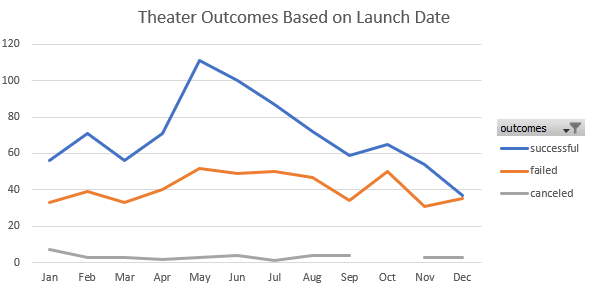
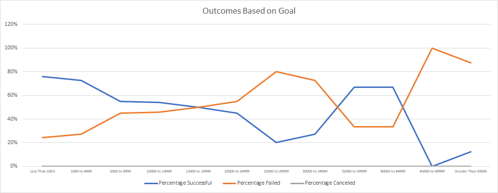

# kickstarter-analysis
Performing analysis on Kickstarter data to uncover trends

# Kickstarting with Excel

## Overview of Project
Analyze Kickstarter dataset using basic excel formulas/functionalities within excel such as pivot tables, charts, sum(), and countifs().
Data analyzed include: campaign category, goals, pledged results, and campaign laucnh dates.

### Purpose
Visualize trends in campaign categories/subcategories based on different parameters, such as:
- Campaign Launch Date. Example results using campaign the "Theater" category will be provided.
- Campaign Goal Amount. Example results using the "Plays" sub-category will be provided.

## Analysis and Challenges
The folllowing charts are intended to adhere, as close as possible, to the requested layout.

### Analysis of Outcomes Based on Launch Date

  

Y-axis values represent the number of each campaign result.
X-axis are months of campaign launch date from May 2009 to March 2017.

### Analysis of Outcomes Based on Goals
  
Campaign goals are all assumed to be in whole numbers.

### Challenges and Difficulties Encountered

Opporunities for Improvement: the dataset was sufficiently small to not require the conversion of range to table and also to not require the use of dynamic formulas. If the dataset was larger and the analysis required was more complex, it would be better. 

## Results

- Two conclusions that can draw about the Outcomes based on Launch Date:
  - May, June, and July Launch Dates are most apparent as the "best" month for a successful campaign in both the # and % of successful campaigns.
    - However, these 3 months are the most busiest/competitives months as they also see the highest number of failed campaigns. 
  - Februray, April, and November are also great choices, with similar success ratios to the 3 months above but with fewer campaigns to compete against.

- Conclusion drawn from Outcomes based on Goals
  - For most projects, it is recommended that the goal does not exceed $14,999 unless the campaign is a "big hitter", in which a goal between 35,000 and 39,999 will be ideal.

- Limitations of the Dataset:
  - The total dataset encompasses 4114 campaigns, from 21 countries, laucnhed between May 17th, 2009 and March 15, 2017.
  - When analyzing datasets by month, April was analyzed fewer than any other month, while incomplete months for May 2009 and March 2017 were analyzed.
  - The Kickstarter dataset used was not obtained directly from Kickstarter and the completeness of this dataset is not known. 

- What are some other possible tables and/or graphs that we could create?
