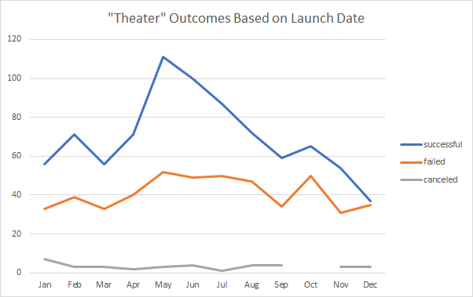

# kickstarter-analysis
Performing analysis on Kickstarter data to uncover trends

# Kickstarting with Excel

## Overview of Project
Analyze Kickstarter dataset using basic excel formulas/functionalities within excel such as pivot tables, charts, sum(), and countifs().
Data analyzed include: campaign category, goals, pledged results, and campaign laucnh dates.

### Purpose
Visualize trends in campaign categories/subcategories based on different parameters, such as:
- Campaign Launch Date. Example results using campaign the "Theater" category will be provided.
- Campaign Goal Amount. Example results using the "Plays" sub-category will be provided.

## Analysis and Challenges

### Analysis of Outcomes Based on Launch Date

### Analysis of Outcomes Based on Goals

### Challenges and Difficulties Encountered

## Results

- What are two conclusions you can draw about the Outcomes based on Launch Date?

- What can you conclude about the Outcomes based on Goals?

- What are some limitations of this dataset?

- What are some other possible tables and/or graphs that we could create?
